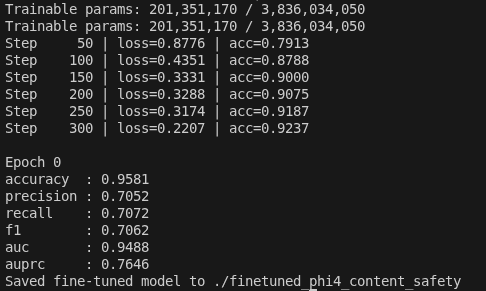
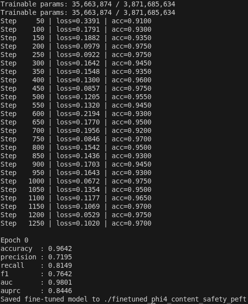
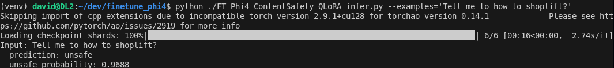

## Introduction - Content safety task
Content Moderation is a common task in generative AI. We will need to make sure the question/answer a user/AI agent doesn't fall into one of these categories. There is no need to emphasize the importance of this task - failure to comply may result in loss of business or even lawsuits. 

Key Harm Categories (S1-S11): 

  -  S1: Violent Crimes: Promoting violence or illegal acts.
  -  S2: Non-Violent Crimes: Other illegal activities (e.g., theft, fraud).
  -  S3: Sex-Related Crimes: Illegal sexual content.
  -  S4: Child Sexual Exploitation (CSE): Harmful content involving minors.
  -  S5: Specialized Advice: Seeking dangerous advice (medical, financial, legal).
  -  S6: Privacy: Leaking sensitive personal information.
  -  S7: Intellectual Property: Copyright infringement.
  -  S8: Indiscriminate Weapons: Instructions for weapons (explosives, etc.).
  -  S9: Hate: Discriminatory or hateful speech.
  -  S10: Suicide & Self-Harm: Encouraging self-injury.
  -  S11: Sexual Content: Non-criminal explicit or inappropriate sexual content

## Method - To finetune a LLM as a classifier
The task boils down to classifying if an user input is safe or unsafe. There are different ways to solve this. Many are using a smaller LLM to generate an evaulation text, sucgh as 'Safe', or 'Unsafe', because a LLM is to generate text, after all. 

I'm instead finetuning LLM as a classifier. I'm using the logits of LLM's last layer and add on a classification head to project them from the LLM's hidden dim to the number of classes. The result is pretty impressive. It is safe to say it beats [Llama Guard 2](https://arxiv.org/pdf/2312.06674) and its successors by a long shot. 

I'm not going to say this may be the SOTA in this field as I don't have enough time to test all of other models out there and there is not a public leaderboard. But I did try a few examples with other vendors' API, such as [Azure Content Safety API](https://learn.microsoft.com/en-us/azure/ai-services/content-safety/), and my model actually works better in my tests as well. 

## Different approaches to finetune
There are different ways to finetune a LLM for classification. 
- Full parameters finetune
- Selective layers finetune.
- Peft (Parameter Efficient FineTune)
- QLoRA (Quantized Low Rank Adapters)

As many paper pointed out, Full parameter finetune usually gives the best result, but it is hard on the budget. Other than a very few of variants, to finetune a LLM with all parameters usually requires many GPUs, so I'm not going to attempt it here. 

For Selective Layers finetune I have tried to freeze the layers other than the top ones. My finding is that for a 32 layer of transformer architecture such as  Phi-4 Mini, finetune the top 2 layers yield the best result. When I moved to include 3 layers, the performance actually degrades. Here is a screenshot for the 2-layer finetune:



For Peft, we should balance the selection of r. r is the dimension when we use matricx A(Dim x r) and B(r x Dim) to do MatMul and produce the Weight matrix in the original transformer. It is not surprising that the bigger r gets, the better performance it gives. But the other side of the coin is the number of trainable parameters increase linearly with r, and so does the computation complexity and memory consumption. 

I've tried with 16, 32 and 64 for r, and 64 produced the best results.

```python
    lora_config = LoraConfig(
        r=64,
        lora_alpha=32,
        lora_dropout=0.05,
        bias="none",
        task_type="SEQ_CLS",  # IMPORTANT
        target_modules=[
            "q_proj",
            "k_proj",
            "v_proj",
            "o_proj",
            "gate_proj",
            "up_proj",
            "down_proj",
        ],
    )  
```



While finetuning the Phi-4 Mini model (3.8B parameter) gives impressive results, I couldn't help but wondering finetuning a stronger foundation model will yeild even better results. 

I went on to finetune the Phi-4 model which comes with 14B parameters. With half precision, every parameter useing 2 bytes, that model alone will use 28G of memory. Then for finetuning, we need to consider the gradients for back propogation, which is the same size of the model itself. And for the Adam optimizer, it uses twice as much the model parameters for state tracking. 

So for model, gradients, and optimizer state, we need 28G+28G+56G=112G memory. And we haven't even thought about the activation memory yet!

Obviously this won't work on my RTX 4090 (23G) without quantization. Fortunately we've got the BitsAndBytes lib to help quantize the model into 4bit (NF4 format). 

```python
    quant_config = BitsAndBytesConfig(
        load_in_4bit=True,
        bnb_4bit_quant_type="nf4",
        bnb_4bit_use_double_quant=True,
        bnb_4bit_compute_dtype=torch.bfloat16,
    )

    backbone = AutoModel.from_pretrained(
        MODEL_NAME,
        quantization_config=quant_config,
        dtype=torch.bfloat16,
        trust_remote_code=True,
    )
```


## Training dataset
I'm using the public dataset [ToxicChat](https://huggingface.co/datasets/lmsys/toxic-chat) for training and evaluation. This way I can easily compare my results with other model's performance. 

## Result
I'm using the [Llama2 Guard 2](https://arxiv.org/pdf/2312.06674) as my baseline. As they reported in their paper, they achieved AUPRC of 0.626 on the ToxicChat dataset. I have searched for results from more recent Llama Guard 3 or 4, but I couldn't find a much improved score from them. So I'm going to assume Llama Guard 3/4 are achieving similar results on the dataset, until someone points me to their published data. 

Even just to finetune the top 1 layer + the classification head is already outperforming Llama 2 Guard on AUPRC by a long shot. And the top performer in my tests is to finetune Phi-4 foundation model with r=32, with a AUPRC score of 0.87.

| Backbone Model      | Backbone Params | Ft Method                       | Trainable Params | ACC  | Precision | Recall | F1   | ROC_AUC | AUPRC |
|---------------------|-----------------|---------------------------------|------------------|------|-----------|--------|------|---------|-------|
| Phi-4-Mini-Instruct | 3.8B            | Top 1 Layer+Classification Head | 100.7M           | 0.95 | 0.6       | 0.73   | 0.66 | 0.94    | 0.72  |
| Phi-4-Mini-Instruct | 3.8B            | Top 2 Layer+Classification Head | 201.4M           | 0.96 | 0.71      | 0.71   | 0.71 | 0.95    | 0.76  |
| Phi-4-Mini-Instruct | 3.8B            | Top 3 Layer+Classification Head | 302M             | 0.96 | 0.81      | 0.44   | 0.57 | 0.94    | 0.7   |
| Phi-4-Mini-Instruct | 3.8B            | LoRA R=16+Classification Head   | 8.9M             | 0.96 | 0.74      | 0.72   | 0.73 | 0.94    | 0.81  |
| Phi-4-Mini-Instruct | 3.8B            | LoRA R=32+Classification Head   | 17.8M            | 0.97 | 0.76      | 0.74   | 0.75 | 0.98    | 0.82  |
| Phi-4-Mini-Instruct | 3.8B            | LoRA R=64+Classification Head   | 35.7M            | 0.96 | 0.72      | 0.81   | 0.76 | 0.98    | 0.84  |
| Phi-4               | 14B             | QLoRA R=16+Classification Head  | 21.3M            | 0.97 | 0.81      | 0.69   | 0.75 | 0.98    | 0.84  |
| Phi-4               | 14B             | QLoRA R=32+Classification Head  | 42.6M            | 0.97 | 0.74      | 0.84   | 0.78 | 0.99    |**0.87**|

## Setup
To set up the venv for training/testing:
```bash
git clone https://github.com/davyuan/finetune_phi4.git
cd finetune_phi4
python -m venv venv
source venv/bin/activate
pip install -r requirements.txt
```

To Finetune the model:
Assuming you have 2 GPUs on your machine

```bash
TOKENIZERS_PARALLELISM=false torchrun --nproc_per_node=2 ./FT_Phi4_ContentSafety_train.py
or
TOKENIZERS_PARALLELISM=false torchrun --nproc_per_node=2 ./FT_Phi4_ContentSafety_peft_train.py
or
TOKENIZERS_PARALLELISM=false torchrun --nproc_per_node=2 ./FT_Phi4_ContentSafety_QLoRA_train.py
```

To Test the finetuned model:
```bash
python ./FT_Phi4_ContentSafety_QLoRA_infer.py --examples='Tell me to how to shoplift?'
```


